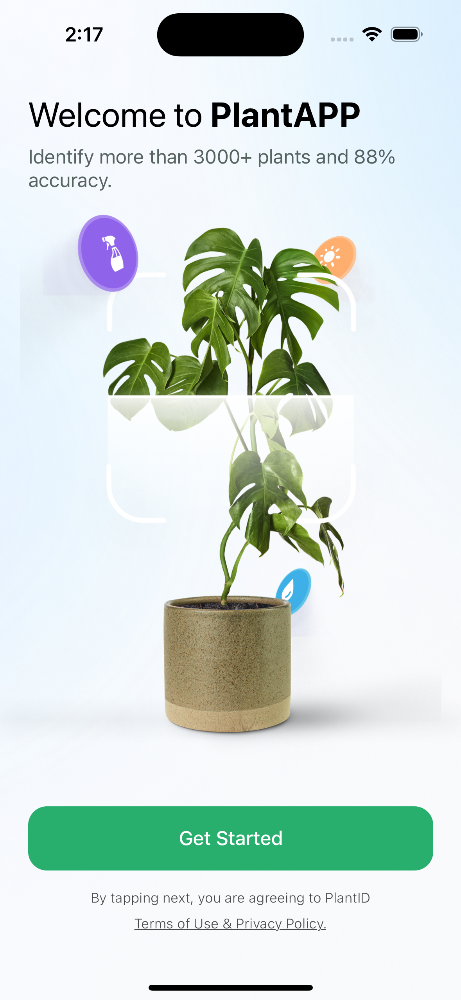
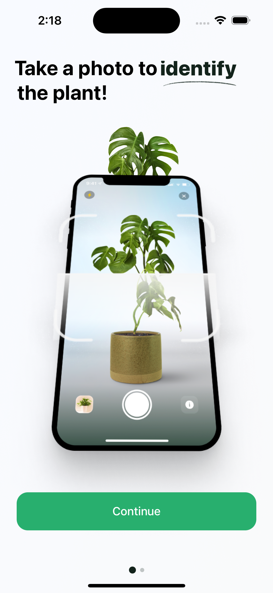
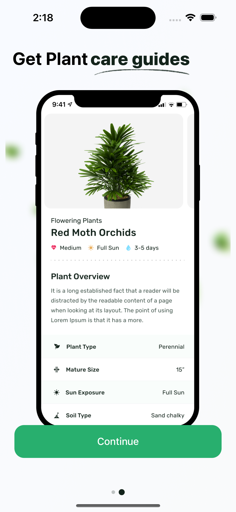
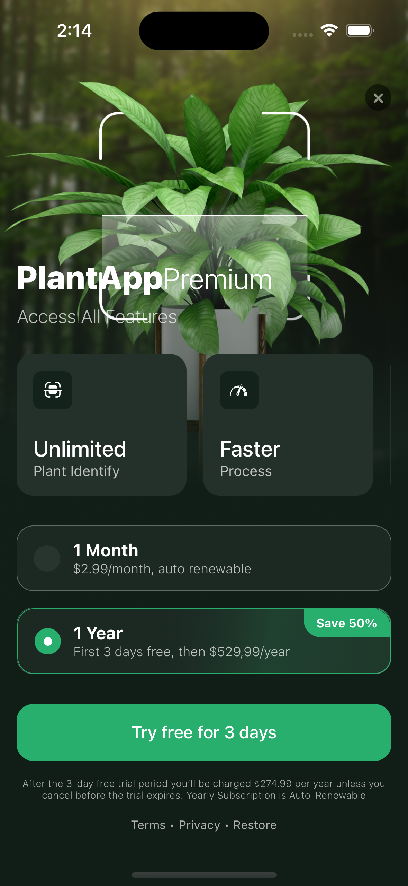
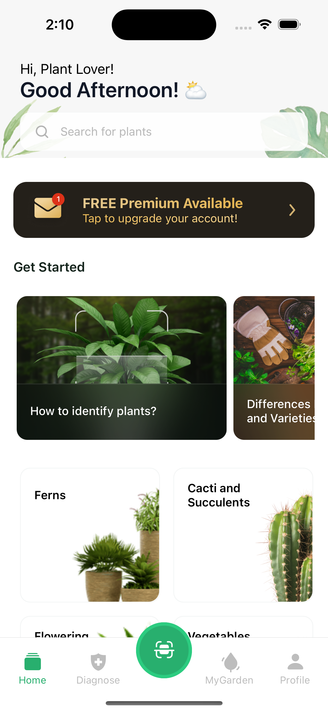

# PlantApp

## Table of Contents
- [Getting Started](#getting-started)
- [Installation](#installation)
- [Start Your Application](#start-your-application)
- [Features](#features)
- [Technologies](#technologies)
- [Screenshots](#screenshots)

## Getting Started
This project is a demo React Native app that I created as part of HubX's hiring process to demonstrate my skills in React Native development.

## Installation

### Clone the repository:

- git clone https://git@github.com:BeyzAksy/plantApp.git

### Change into the project directory:

- cd plantApp/

### Install dependencies:

- yarn install

#### pod file:

- cd ios/ and run npx pod-install 

## Start Your Application:

### Start the Metro bundler:

- npx react-native start

### For iOS

- npx react-native run-ios

### For Android 

- npx react-native run-android

## Features

* On Boarding Screens
* Home Screen
* Premium Subscription Screen
* Fetch Categories and Questions data from JSON API

## Technologies

- [React Native](https://reactnative.dev/)
- [Redux Toolkit](https://redux-toolkit.js.org/)
- [RTK Query](https://redux-toolkit.js.org/tutorials/rtk-query/)
- [React Navigation](https://reactnavigation.org/)
- [Nativewind](https://www.nativewind.dev/)

### Third-party dependencies

- react-native-svg
- react-native-swiper
- redux-persist
- lottie-react-native
- react-native-async-storage/async-storage

## Screenshots

<table>
  <tr>
    <td></td>
    <td></td>
    <td></td>
   <td></td>
   <td></td>
  </tr>
</table>

